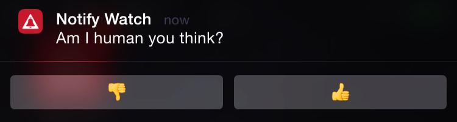

> **NOTE:** This sample app and README is under construction and **will** change.

# Interactive Notifications for iOS and Apple Watch
**Or...** Supporting Apple Watch without the Kit or a Watch OS 2 app.

## Titanium & Apple Watch
Titanium 4.1 already supports linking a WatchKit Extension built in Xcode and our September 2015 release adds support for linking and communicating with Watch OS 2 apps built using Swift. Of course we are also working on solutions to build an actual Watch OS 2 app in JavaScript using Titanium.

## Interactive Notifications
In my personal experience, I've seen that what I use most of the Apple Watch are interactive notifications. Third party apps are simply often too slow, although I assume that will improve with Watch OS 2. Interactive notifications were already available for phone and tablet but proved even more useful on the watch. Getting a notification about an incoming message is fine, but if I don't have to grab my phone to reply we are really talking - literally! I rather still use my phone instead of having to type or dictate on my watch, but interactive notifications enable me to select from a list of common replies and other actions such as *Mark as Read*.

The good news: You can use interactive notifications since Titanium  3.4.0 and while we have to update [the guide](http://docs.appcelerator.com/platform/latest/#!/guide/iOS_Interactive_Notifications) it works for Apple Watch just as well.

## Sample App
I've build a [sample messenger app](https://github.com/appcelerator-developer-relations/appc-sample-notifywatch) to show you how it works. It's a simple WhatsApp-like messaging app. Every time you send a message, a pretty dumb bot will reply with a random answer after 4 seconds. This allows you to move the app to the background or lock your phone to see what happens in different scenarios.

## Architecture
I tried to keep the app as simple as possible.

* You can find all settings in [app/config.json](https://github.com/appcelerator-developer-relations/appc-sample-notifywatch/blob/master/app/config.json)
* In [app/alloy.js](https://github.com/appcelerator-developer-relations/appc-sample-notifywatch/blob/master/app/alloy.js) I set some global constants and helpers and require `app/lib/notifications.js`.
* The bootstrapping for both local and push (interactive) notifications is done in [app/lib/notifications.js](https://github.com/appcelerator-developer-relations/appc-sample-notifywatch/blob/master/app/lib/notifications.js).
* The tab controlled by [app/controllers/console.js](https://github.com/appcelerator-developer-relations/appc-sample-notifywatch/blob/master/app/controllers/console.js) displays log messages so you can read back what happened on the non-UI side of things.
* The actual chat is controlled by [app/controllers/chat.js](https://github.com/appcelerator-developer-relations/appc-sample-notifywatch/blob/master/app/controllers/chat.js).

## Registering for Interactive Notifications

Interactive notifications can be scheduled locally by the app itself or pushed.

In both cases we first have to set up the interactive notification categories and actions. We do this in the first ~120 lines of [app/lib/notifications.js](https://github.com/appcelerator-developer-relations/appc-sample-notifywatch/blob/master/app/lib/notifications.js).

Since iOS 8 you need to use [Ti.App.iOS.registerUserNotificationSettings](http://docs.appcelerator.com/platform/latest/#!/api/Titanium.App.iOS-method-registerUserNotificationSettings) to set the notification types (alert, badge, sound) for both local and push. We use the same method to set the [categories](http://docs.appcelerator.com/platform/latest/#!/api/Titanium.App.iOS-method-createUserNotificationCategory) which in turn hold their [actions](http://docs.appcelerator.com/platform/latest/#!/api/Titanium.App.iOS-method-createUserNotificationAction).

### Categories

A category may define two sets of actions. One of 1-4 actions for alert-style and Apple Watch notifications and another of 1-2 actions for other styles. If you don't set the latter it will simply take the first two of the first. Please note that on Apple Watch it will only display actions that can be processed in the background.

### Actions
Apart from an identifier and title there's a few things you can set:

* [activationMode](http://docs.appcelerator.com/platform/latest/#!/api/Titanium.App.iOS.UserNotificationAction): If set to `Ti.App.iOS.USER_NOTIFICATION_ACTIVATION_MODE_BACKGROUND` it will just let you handle the action without opening the app to the user.
* [authenticationRequired](http://docs.appcelerator.com/platform/latest/#!/api/Titanium.App.iOS.UserNotificationAction-property-authenticationRequired): If set to `true` and the user is **not** responding via his watch, he user must authenticate first, even if the device is not locked.
* [destructive](http://docs.appcelerator.com/platform/latest/#!/api/Titanium.App.iOS.UserNotificationAction-property-destructive): Will display the action in red if presented on the lock screen or watch.

And as you can see, the [title](http://docs.appcelerator.com/platform/latest/#!/api/Titanium.App.iOS.UserNotificationAction-property-title) may contain emojis - yeah!

### Local
From [line ~128](https://github.com/appcelerator-developer-relations/appc-sample-notifywatch/blob/master/app/lib/notifications.js#L128) we listen for local notifications.

The *regular* event [notification](http://docs.appcelerator.com/platform/latest/#!/api/Titanium.App.iOS-event-notification) is fired when the app is opened via a local notification but without selecting an action. It also fires when the app was in the foreground while receiving the notification. There's no way to tell the difference, but in both cases we want to present the message to the user so he can reply.

A separate [localnotificationaction](http://docs.appcelerator.com/platform/latest/#!/api/Titanium.App.iOS-event-localnotificationaction) event is fired when the user selects an action. It will have the notification payload as well as the category and selected action identifiers. You can see how we handle this around [line ~157](https://github.com/appcelerator-developer-relations/appc-sample-notifywatch/blob/master/app/lib/notifications.js#L157). Since we have push notifications as well, I choose to use a event dispatcher created in [alloy.js](https://github.com/appcelerator-developer-relations/appc-sample-notifywatch/blob/master/app/alloy.js#L22) and trigger a custom `action` event with the required payload. I'll listen to this event in the console and chat controllers.

### Push
The sample app is prepared to receive interactive push notifications in [lines 170+](https://github.com/appcelerator-developer-relations/appc-sample-notifywatch/blob/master/app/lib/notifications.js#L171), but you will need to [create an ArrowDB datasource](https://platform.appcelerator.com/#/api.new) and add your key in [tiapp.xml](https://github.com/appcelerator-developer-relations/appc-sample-notifywatch/blob/master/tiapp.xml#L18) for it to [work](https://github.com/appcelerator-developer-relations/appc-sample-notifywatch/blob/master/app/alloy.js#L20). You can then use the [Dashboard](http://docs.appcelerator.com/platform/latest/#!/guide/Sending_and_Scheduling_Push_Notifications-section-43298780_SendingandSchedulingPushNotifications-InteractiveNotifications(iOS8andlater)) or [API](http://docs.appcelerator.com/platform/latest/#!/guide/iOS_Interactive_Notifications-section-40930452_iOSInteractiveNotifications-SendanInteractivePushNotification) to send them by including a valid `category` value.

When the user has responded to a push notification by selecting an action, the [remotenotificationaction](http://docs.appcelerator.com/platform/latest/#!/api/Titanium.App.iOS-event-remotenotificationaction) will be fired. We handle this in the same way as we did for local notifications.

## Sending a Local Interactive Notification
The console tab has a button to quickly test a local interactive notification. In [app/controllers/console.js](https://github.com/appcelerator-developer-relations/appc-sample-notifywatch/blob/master/app/controllers/console.js#L17) you can see how we schedule it.

* [alertAction](http://docs.appcelerator.com/platform/latest/#!/api/NotificationParams-property-alertAction): Should be a verb plus optional subject since it will used instead of the default *Open* for alert-style notifications and in *Slide to [alertAction]* on the lock screen.
* [category](http://docs.appcelerator.com/platform/latest/#!/api/NotificationParams-property-category): Must be the identifier for one of the interactive notification categories we registered.
* [userInfo](http://docs.appcelerator.com/platform/latest/#!/api/NotificationParams-property-userInfo): Can be any object. Our sample uses it to pass the ID of the message which we need to handle the action.

## The chat
I won't go into too much detail on how the chat works, but here's what [app/controllers/chat.js](https://github.com/appcelerator-developer-relations/appc-sample-notifywatch/blob/master/app/controllers/chat.js) does:

* It uses [Alloy data-binding](http://docs.appcelerator.com/platform/latest/#!/guide/Alloy_Data_Binding) to render the messages.
* It listens to the `action` event fired in `notifications.js` to execute the action the user selected in [onAction()](https://github.com/appcelerator-developer-relations/appc-sample-notifywatch/blob/master/app/controllers/chat.js#L43).
* When you send a message it will set a 4s timeout to [add it to the collection](https://github.com/appcelerator-developer-relations/appc-sample-notifywatch/blob/master/app/controllers/chat.js#L163) and [show the local interactive notification](https://github.com/appcelerator-developer-relations/appc-sample-notifywatch/blob/master/app/controllers/chat.js#L193).
* Then finally there's some logic to update the app and tab badges and mark messages as read when you see or reply to them.

### onAction

## Final notes

## Links

- 

---------------

## Notes To Myself
Stuff I need to add/check:

* authenticationRequired:false + FOREGROUND is useless? Will still show and ask to unlock.
* Show screenshots of all types?
* When the app is in foreground it will not display a notification
* When to reset the badge? When the app opens/resumes? Take chat app as example where you would update the badge when a thread was read.
* alterLaunchImage (still works with assetcatalog?)
* Still need to fix the LiveView bug
